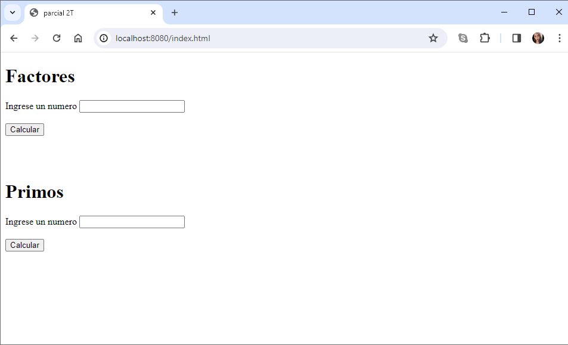
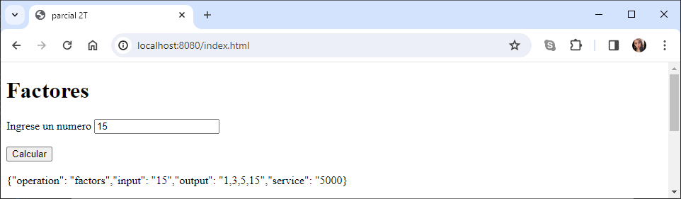
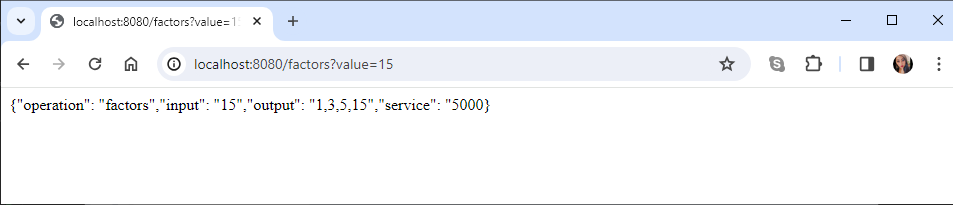
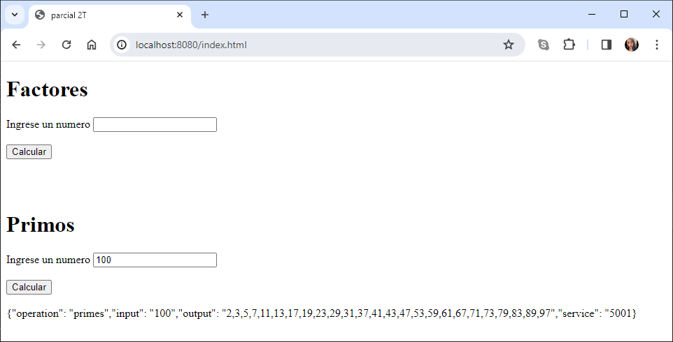
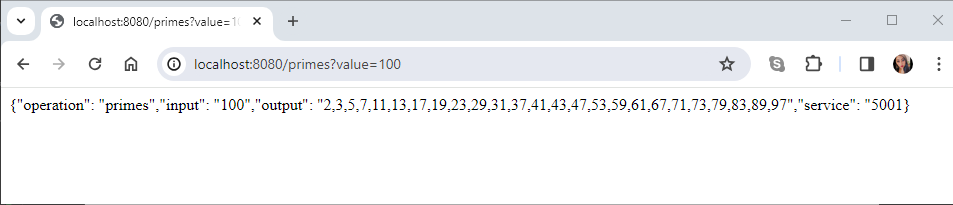
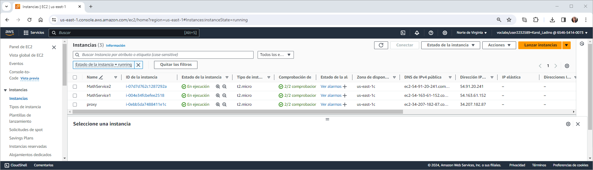

# Parcial AREP 2T

Se construyo un aplicación web para calcular 
los factores de un número 
losnúmeros primos hasta un número dado. 

El programa esta desplegado en tres instancias de EC2 en AWS, una para un proxy y dos para mathService.

---
### Prerrequisitos

* Maven
* Git
* Java -17
* AWS

---


## Instalación 

1.Clonamos el repositorio
```
https://github.com/20042000/AREP_Parcial2.git
```
2.Nos movemos a la carpeta
```
cd AREP_Parcial2
```

## Ejecución

**Importante:** Para ejecutar el proyecto se deben abrir dos consolas desde la raíz del proyecto, que en este caso sería ***AREP_Parcial2***

A. En una de las consolas vamos a ejecutar los siguientes comandos:

1.Nos movemos a la carpeta proxy
```
cd proxy
```
2.Vamos a establecer las variables de entorno que necesitamos para nuestro proyecto

***Host1:***
```
$env:MATHSERVICE_HOST1="http://localhost"
```
***Puerto Host1:***
```
$env:PORT_HOST1=5000
```

***Host2:***
```
$env:MATHSERVICE_HOST2="http://localhost"
```
***Puerto Host2:***
```
$env:PORT_HOST2=5000
```

**Nota:** Para verificar que se haya creado correctamente cada una de las variable podemos usar el siguiente comando remplazando el nombre por el de la variable que queremos consultar:
```
echo $env:NOMBRE_VARIABLE
```
```
echo $env:MATHSERVICE_HOST1
echo $env:PORT_HOST1
echo $env:MATHSERVICE_HOST2
echo $env:PORT_HOST2
```

3.Construimos el proyecto
```
mvn package
```
4.Ejecutamos nuestro microservicio proxy con el siguiente comando:

***Windows:***
```
mvn exec:java -"Dexec.mainClass"="edu.eci.arep.ase.app.SparkController"
```

B. Ahora en la otra consola vamos a ejecutar los siguientes comandos:

1.Nos movemos a la carpeta mathService
```
cd mathService
```

2.Construimos el proyecto
```
mvn package
```
3.Ejecutamos nuestro microservicio proxy con el siguiente comando:

***Windows:***
```
mvn exec:java -"Dexec.mainClass"="edu.eci.arep.ase.app.SparkController"
```

2.Probamos nuestro proyecto ingresando con el siguiente link a nuestro browser, en donde podremos probar la funcionalidad de factores y primos:
```
http://localhost:8080/index.html
```



**Nota:** Este formulario nos ofrece dos funcionalidades una en la que se calculan los factores de un número y otra en la que se claculan los números primos hasta un número dado. Paro probar estas funcionalides debe ingresar un número en cada uno de los campos y luego dar clic en el botón Calcular

***1. Factores***


* **Nota:** También podemos probar el factor mediante url, para esto debe indicar despues del igual ("=") el número del que desea conocer los factores, que en este caso va a ser 15

```
http://localhost:8080/factors?value=15
```



***2. Primos***



* **Nota:** También podemos probar los numeros primos mediante url, para esto debe indicar despues del igual ("=") el número hasta el que desea conocer los primos, que en este caso va a ser 100

```
http://localhost:8080/primes?value=100
```



### Despliegue en AWS

Se crearon tres instancias en EC2
1. Proxy
2. MathService1
3. MathService2

Como se observa en la siguiente imagen:


La instalación y ejecución del proyecto es similar a la descrita anteriormente, con la diferencia de que en la instancia del proxy la declaración de las variables de entorno debe ser de la siguiente manera:

***Host1:***
```
export MATHSERVICE_HOST1="http://ec2-54-163-61-152.compute-1.amazonaws.com"
```
***Puerto Host1:***
```
export PORT_HOST1=5000
```

***Host2:***
```
export MATHSERVICE_HOST2="http://ec2-54-91-20-241.compute-1.amazonaws.com"
```
***Puerto Host2:***
```
export PORT_HOST2=5000
```
**Nota:** Para verificar que se haya creado correctamente cada una de las variable podemos usar el siguiente comando remplazando el nombre por el de la variable que queremos consultar:
```
echo $NOMBRE_VARIABLE
```

```
echo $MATHSERVICE_HOST1
echo $PORT_HOST1
echo $MATHSERVICE_HOST2
echo $PORT_HOST2
```


En el siguiente link encontrara el video donde se evidencia el despliegue en AWS:

```
https://youtu.be/w0HKSoZeukk
```


### Construido con

* Maven
* Git
* GitHub
* Java -17
* JavaScript
* HTML
* Visual Studio Code
* AWS

## Autor

* **[Karol Daniela Ladino Ladino](https://www.linkedin.com/in/karol-daniela-ladino-ladino-55164b272/)** - [20042000](https://github.com/20042000)


## Licencia
**©** Karol Daniela Ladino Ladino. Estudiante de Ingeniería de Sistemas de la Escuela Colombiana de Ingeniería Julio Garavito

