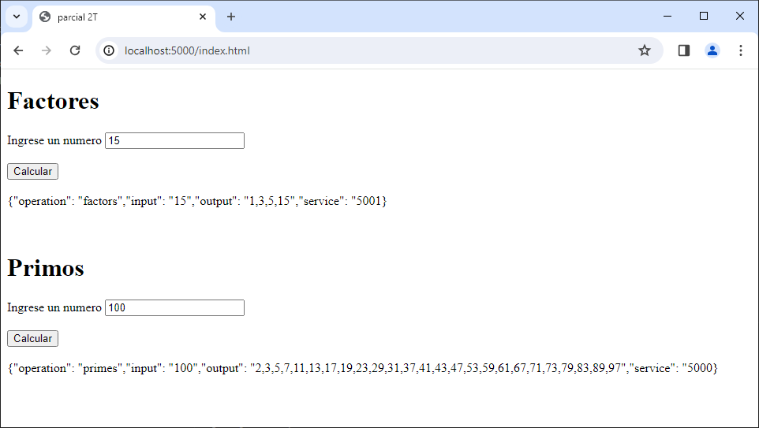
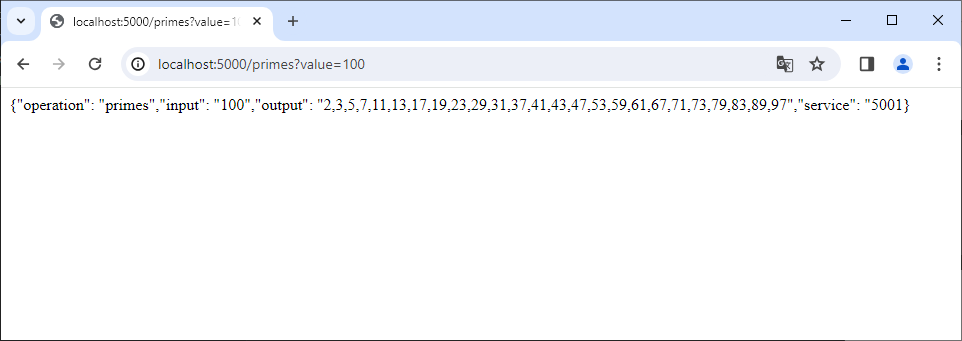

# Parcial AREP 2T

---
### Prerrequisitos

* Maven
* Git
* Java -17
* AWS

---


## Instalación

1.Clonamos el repositorio
```
https://github.com/20042000/AREP_Parcial2.git
```
2.Nos movemos a la carpeta
```
cd AREP_Parcial2
```
3.Costruimos el proyecto
```
mvn package
```

## Ejecución
1.Ejecutamos nuestro proyecto con el siguiente comando:

***Windows***
```
mvn exec:java -"Dexec.mainClass"="edu.eci.arep.ase.app.SparkController"
```

2.Probamos nuestro proyecto ingresando con el siguiente link a nuestro browser, en donde podremos probar la funcionalidad de factores y primos:
```
http://localhost:5000/index.html
```


* **Nota:** Para probar el fromulario debe ingresar un nuemro en cada uno de los campos y luego dar clic en el boton Calcular

**Tambien podemos probar las funciones de la siguiente manera:**

***1. Factores***
```
http://localhost:5000/factors?value=15
```


* **Nota:** Para probar el factorial de esta manera, debe indicar despues del igual ("=") el numero 

***2. Primos***
```
http://localhost:5000/primes?value=100
```



### Despliegue en AWS

En el siguiente link encontrara el video donde se evidencia el despliegue en AWS:

### Construido con

* Maven
* Git
* GitHub
* Java -17
* JavaScript
* HTML
* Visual Studio Code
* AWS
